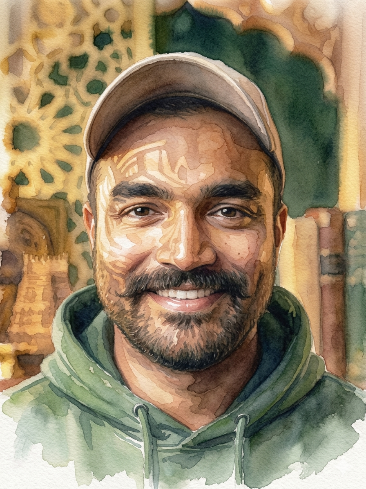

  
  

    <h1>Vishnu Nair</h1>
    
AI/ML engineer — agentic systems, data platforms, and AI safety.

  

A decade of engineering in the Bay Area — senior roles at **Cisco ThousandEyes**
and **Meta**, and founding-engineer work at **Hone Capital**. My recent focus is
production LLM agent systems and AI application security. I'm currently **Lead
Engineer at NuGuard AI**, an alumnus of **Johns Hopkins** (M.S., Security
Informatics), and pursuing graduate study toward a **PhD in AI/ML with a focus
on technical AI safety**.

## Contact

- Email — [vnair91@gmail.com](mailto:vnair91@gmail.com)
- GitHub — [github.com/viznu](https://github.com/viznu)
- LinkedIn — [linkedin.com/in/vishnu-nair](https://www.linkedin.com/in/vishnu-nair)
- Medium — [medium.com/@vsnr](https://medium.com/@vsnr)
