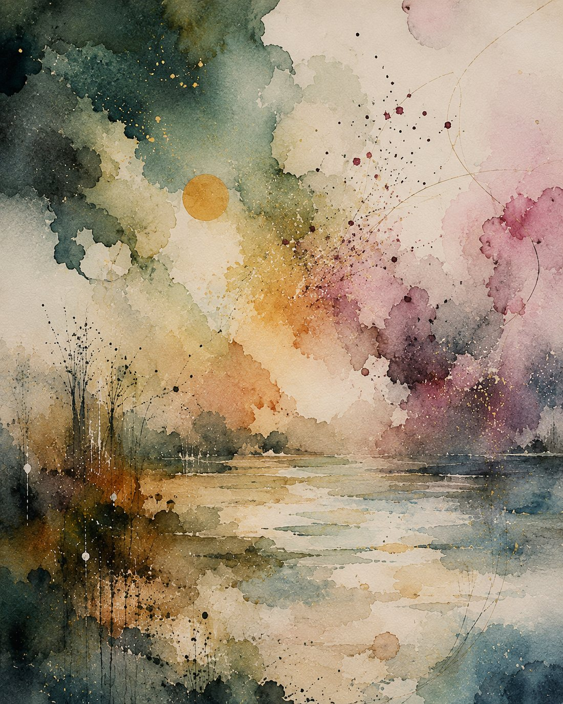

slowly.
in the want of wanting.
besiege me.
like a storm would an isle.

in the dark
secret petals
of your bosom
tangle me,
like a waiting spider.

my lover of slow streets,
and lonely teas,
into memory's ponderous deserts
have i wandered
for a drop of you.

the death of another
passing year,
come winter's ice,
but emboldens
the low,sooty fires of want.

