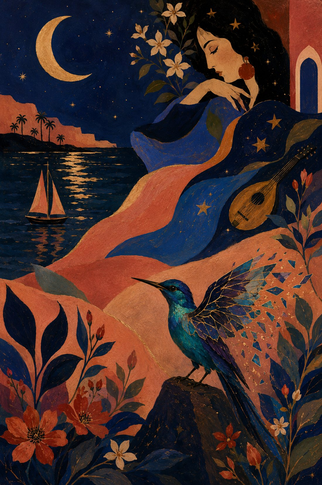

Has the moon, your lover,
Come seeking
The graces of your dreamy gaze?

What did he tell of
secret jasmine jungles
Writhing in the salt breeze
Of a distant ocean?

Does he sing to you,
Strumming a mandolin
Strung with gossamer galaxies
hushing the famine of your senses?

Oh beautiful,
would he wrench the stars
of their wistful light
To adorn your ruby ears?

Did he scribe your loveliness
With a calligraphy
That bespoke the contours of your soul?

But here I lie, a bird broken,
By doubt's leaden feathers,
an ocean and half away.

