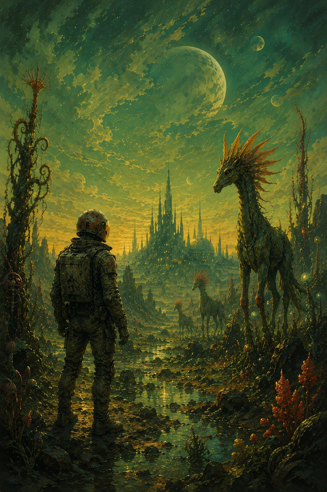

<!-- Artwork: drop an image at assets/metanoia.jpg, then follow the pattern in
thousand-roads.md — wrap the page in 

(hex = a color pulled from the painting) and add:

-->

Fruit of bitter seed,
and twisted tree,
With quiet brevity,
Language once lost me.

Cell towers bristle,
As winds whistle,
In the winding streets,
Of the City.
Homeless monologues,
And cold fogs,
Newspaper breeze,
Peddling street-corner treats.

At dusk, all the birds
Grieve the colors bled
A golden city red,
Weeps young love's,
Tender death.

As the stillness falls,
Struggle no more and be,
Remember me,
This moment is infinity.

