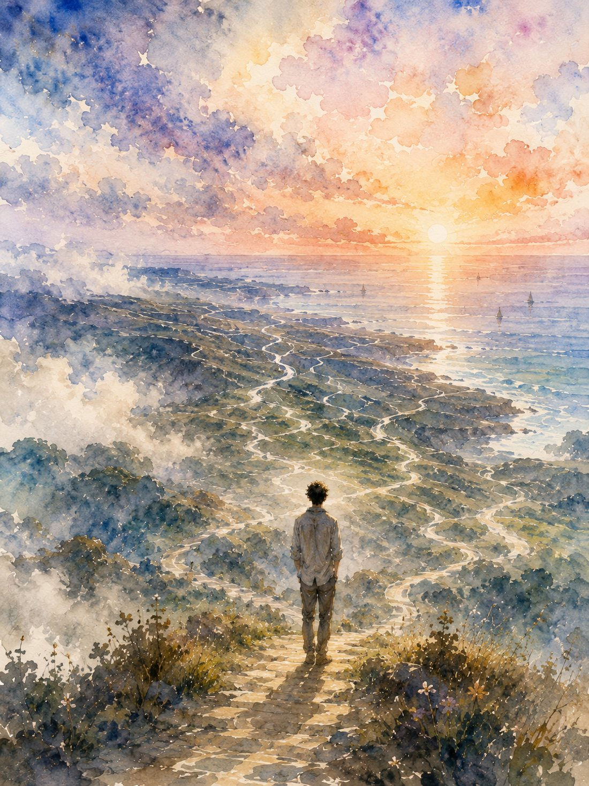

All these thousand roads lead to the sea
I am not yet where I need to be
I'm a painted hollow
Glossy under lights
Solitary rot
silver tongued.
I'm a snake
I'm the morning wood smoke
In the fog
That thieves up the spine.

I'm all bruised elbows and knees
These tears that my pain frees

All these thousand roads lead to the sea
I am not yet where I need to be

