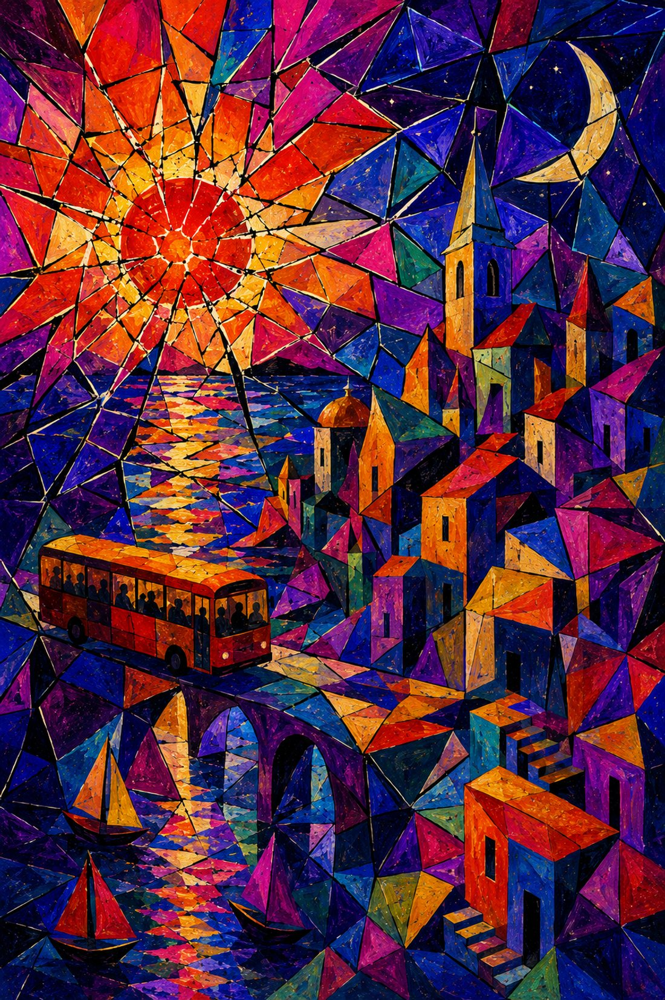

<!-- Artwork: drop an image at assets/uno.jpg (or .png) and uncomment:

-->

Between the leaden sun
In an evening sky
And the stardust
Of secret constellations
Lay the expanse of tonight's sigh.
Try not to wear this heart out
For troubles come and go.
You are my secret poem
To read in times of trouble.
A whisper made wind,
A promise to see me through.
War not,
This quiet night.

Such tepid dams of expression
these foreign words make.
Fly ridden and secular
These pre-dawn buses of independence
tooth across
Wagnerian skies and feeble earths.
OldManSociety pandhandling
corners
for change.
Ive hungered for the mystical
On the shores of my Babylon
To seek a straight arrow to
To quell these angry tides of
My many coloured voices
All which beseech the word of the True.
The antipodes of the self
Girdled by a wakefulness
In looks between thoughts between words.

## dos

Flung amidst ýesterday's stars,
I get no letters mother,
Rains or otherwise.
But I get along,
In places compliant
To sun drunk insects
And shy of company.
A thousand roads lead away
To the blankness of the sea.

