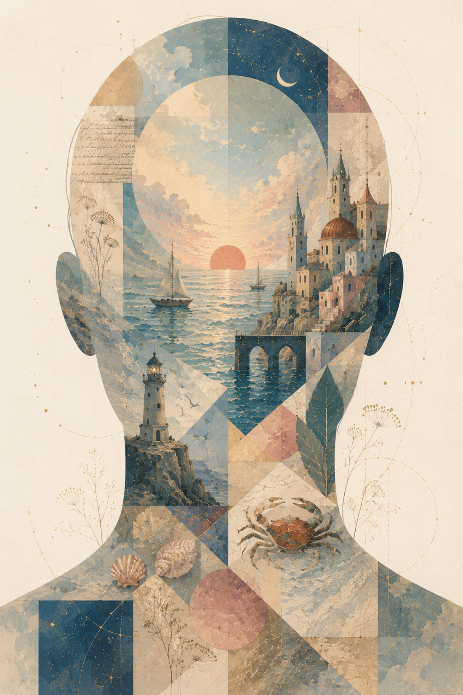

<a class="poem-back" href="/off-the-clock/poetry/" aria-label="Back to poems">&#8592;</a>

Where do all the thoughts of
Our wakefulness go sleep?
With their ephemeral purposes served,
to be banished by the inception of another?
........ or to be bidden
By strange purpose,
Not unlike the common trout;
Thieving up secret creeks,
Into the magnificent continents
Of the Waking Mind;  the I;
And there to forever lie
Until recollection's heat
Glints off them, pomegranate red,
Into memory once more ?
But some lurk in darker straits; kraken-like,
In hadal depths of despair.
Some to scribe triumphantly, an aching sky,
With new constellations
To mark eternity.
And yet some may still yet find,
Drifting by once-haunted meridians
(And with a little luck)  By fate's godless winds,
What khaki shores there may be,
Of the old country;
Bruised an eerie purple by starlight;
And dreaming the dreams
Of crabs and seashells;
Bejeweled by the salts of a thousand seas and
trailing it's rich tapestry into a cherry dusk;
Curving away into a smiling promise of treasure.
Alas! but for the blinding ways of low malice,
Some may as well set fire to the whole lot of it.

If you find yourself lost at sea,
Starless and luckless,
And beaten by the gales of weighty thoughts and sullen words,
Remember the promise.
That with every sacred hurt
And ragged breath,
Will come a storm.
Hold still but, dearest.
Love will stay your sails.

